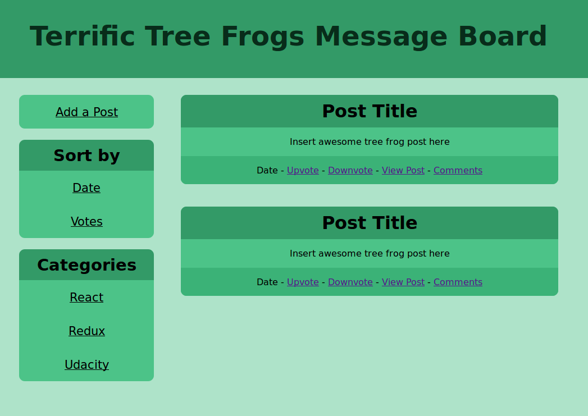
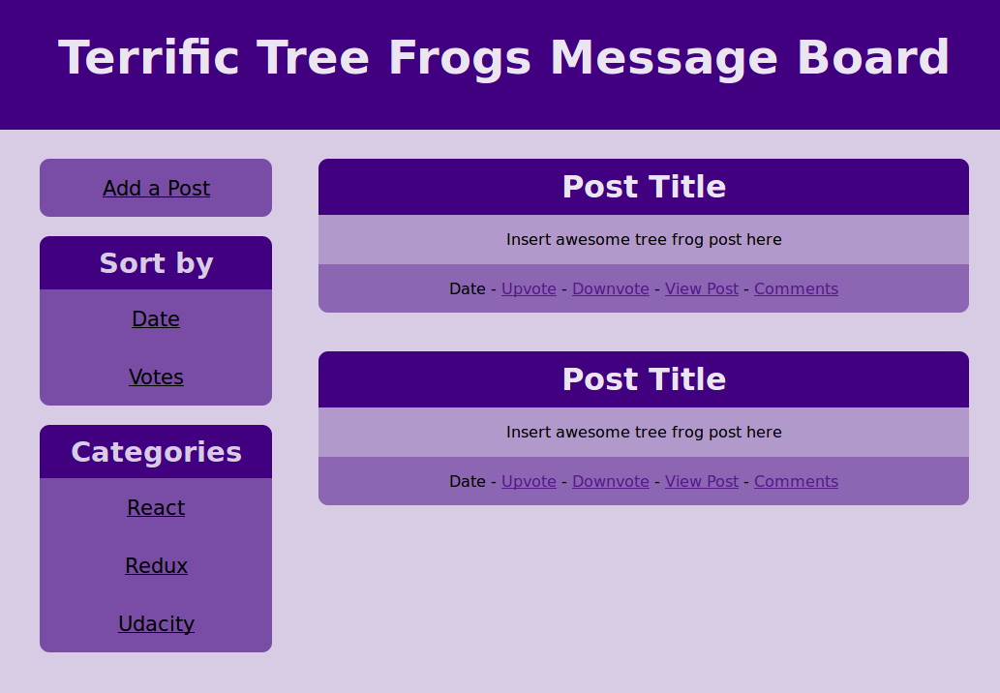
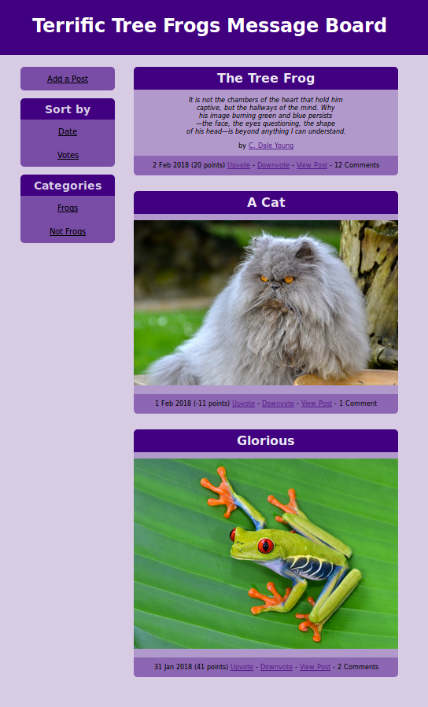

# Terrific Tree Frogs Message Board

This React/Redux app is a message board allowing anonymous users to post, edit, remove, and comment. It was created using [Create React App](https://github.com/facebookincubator/create-react-app) and depends on the Udacity backend in [reactnd-project-readable-starter](https://github.com/udacity/reactnd-project-readable-starter). It's the second project for the [Udacity React Nanodegree](https://www.udacity.com/course/react-nanodegree--nd019).

# Usage

Clone the repository.

```
git clone https://github.com/wicker/Terrific-Tree-Frogs-Message-Board.git
```

Install and start the API backend server.

```
cd backend
npm install
node server
```

Install project dependencies and start the app.

```
cd frontend
npm install
npm start
```

Your browser should automatically open to the correct page.

# User Interface

There are four views. 

The main page lists all posts and all categories with links to the appropriate category view. It also allows the user to add a post and sort the list of posts by timestamp or vote score. 

- Paths:
  - /

- Actions:
  - GET_ALL_COMMENTS
  - GET_ALL_POSTS
  - GET_ALL_CATEGORIES
  - SORT_BY_TIMESTAMP
  - SORT_BY_VOTECOUNT

The category view shows a filtered list of posts belonging to that category.

- Paths:
  - /category/:id

- Actions:
  - GET_ALL_COMMENTS
  - GET_ALL_POSTS
  - GET_ALL_CATEGORIES

The post view shows the post metadata, the post itself, associated comments with the ability to edit/remove comments, and a comment box allowing the user to add a new comment.

- Paths:
  - /post/:id

- Actions:
  - GET_ALL_COMMENTS
  - GET_ALL_POSTS
  - GET_ALL_CATEGORIES
 
The create/edit view allows a user to create or a edit posts.

- Paths: 
  - /add
  - /edit/:id
  - /delete/:id

- Actions:
  - GET_ALL_COMMENTS
  - GET_ALL_POSTS
  - GET_ALL_CATEGORIES
  - ADD_POST
  - EDIT_POST
  - DELETE_POST

# Screenshots







# Design Notes

The app is wrapped in a Provider.

The overall structure of the app:

```
in progress
```

The structure of the Redux store:

```
in progress
```

Backend calls. Was: the [BooksAPI](https://github.com/udacity/reactnd-project-myreads-starter/blob/master/src/BooksAPI.js) calls available are:

```
get(bookid)
getAll()
update(book, shelf)
search(query)
```

The post object includes:

|attribute|type|
|---------|----|
|id|string|
|timestamp|integer|
|title|string|
|body|string|
|author|string|
|category|string|
|voteScore|integer|
|deleted|boolean|

The comment object includes: 

|attribute|type|
|---------|----|
|id|string|
|parentid|string|
|timestamp|integer|
|body|string|
|author|string|
|voteScore|integer|
|deleted|boolean|
|parentDeleted|boolean|
