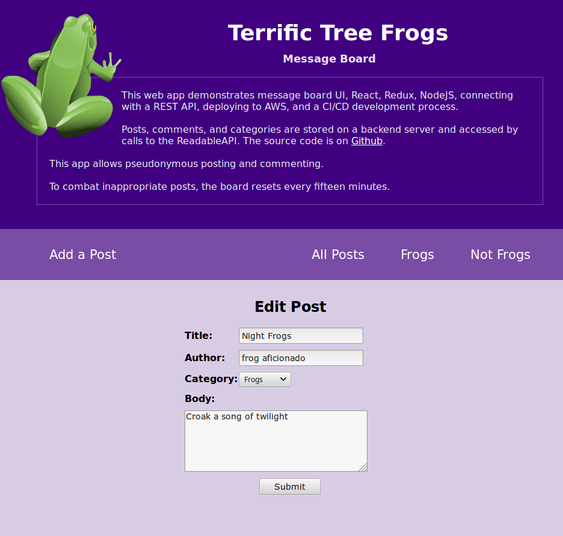

# Terrific Tree Frogs Message Board

[](https://travis-ci.com/wicker/Terrific-Tree-Frogs-Message-Board)

This React/Redux app is a message board allowing anonymous users to post, edit, remove, and comment. It was created using [Create React App](https://github.com/facebookincubator/create-react-app) and depends on the Udacity backend in [reactnd-project-readable-starter](https://github.com/udacity/reactnd-project-readable-starter). It's the second project for the [Udacity React Nanodegree](https://www.udacity.com/course/react-nanodegree--nd019).

# Usage

Clone the repository.

```
git clone https://github.com/wicker/Terrific-Tree-Frogs-Message-Board.git
```

Install and start the API backend server.

```
cd backend
npm install
npm start
```

Install project dependencies and start the app.

```
cd frontend
npm install
npm start
```

Your browser should automatically open to the correct page.

### Screenshots





### Design Notes

This is an extremely simple message board that allows pseudonymous posting and commenting. The app stores posts, comments, and categories on the backend server and uses the [ReadableAPI](https://github.com/wicker/Terrific-Tree-Frogs-Message-Board/blob/master/frontend/src/utils/ReadableAPI.js) calls to access the data.

Our Redux store is split into two parts for a `categories` object and a `posts` object, but the backend stores `posts` and `comments` separately. When we get the posts, we chain getting the comments and sort each comment (which has a parentid that matches a post's id) so our store's `posts` object contains its own comments. 

This saves us a further API call when loading a post, but it means getting all the posts for the index view could suffer later on once we had a ton of posts. 

The code uses ES6 features and extensively depends on the higher-order .map and .filter functions. 

### Future Improvements

- Support uploading images
- Fix hard-coded category rendering logic
